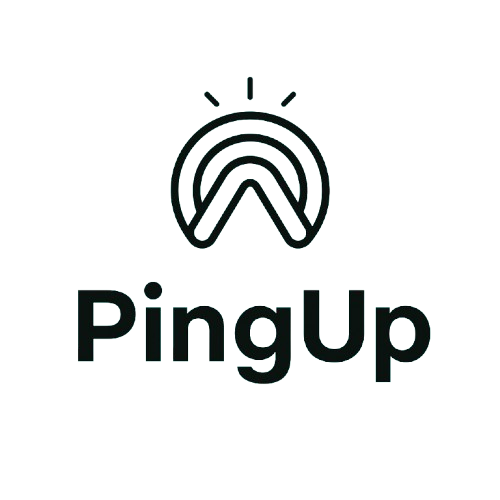

# PingUp - Micro-tutorat en 15 minutes chrono ⏱️

<div align="center">
  
  <p><i>Débloquez vos problèmes en 15 minutes avec des experts disponibles à la demande</i></p>
</div>

## 📚 Présentation du projet

PingUp révolutionne l'aide aux études avec un concept novateur : le micro-tutorat en 15 minutes chrono. Notre plateforme connecte instantanément les étudiants bloqués sur un problème avec des tuteurs experts disponibles immédiatement, pour des sessions courtes et efficaces.

### 🚀 Notre mission

Dans un monde où tout va vite, attendre des heures pour obtenir de l'aide n'est plus viable. PingUp vous fait gagner du temps en vous offrant des réponses immédiates à vos questions, sans rendez-vous ni longues explications. Que vous soyez bloqué sur un exercice de mathématiques, un bug de programmation ou une question de langue, vous obtenez une solution en quelques minutes.

### 💡 Notre différence

- **Rapide** : Connexion avec un tuteur en moins de 3 minutes
- **Efficace** : Sessions de 15 minutes ciblées sur votre problème spécifique
- **Flexible** : Disponibilité 24/7, sans rendez-vous
- **Abordable** : Paiement à la session, sans engagement

## ✨ Fonctionnalités principales

- **Sessions courtes de 15 minutes** : Des réponses rapides et ciblées pour avancer efficacement
- **Recherche intelligente** : Trouvez le tuteur parfait pour votre question spécifique
- **Profils vérifiés** : Des tuteurs experts et certifiés dans leurs domaines
- **Interface intuitive** : Navigation fluide et expérience utilisateur optimisée
- **Diversité de matières** : Plus de 50 disciplines académiques couvertes
- **Système de notation** : Évaluez vos sessions pour améliorer l'expérience

## 🎯 Domaines d'expertise

| Catégorie | Matières |
|-----------|----------|
| 📊 Sciences | Mathématiques, Physique, Chimie, Biologie |
| 💻 Informatique | Programmation, Web, Bases de données, Intelligence artificielle |
| 🌐 Langues | Anglais, Espagnol, Allemand, Chinois |
| 📈 Business | Marketing, Finance, Comptabilité, Management |
| 🎨 Design | Graphisme, UI/UX, Animation, Modélisation 3D |
| 📝 Rédaction | Dissertations, Lettres, CV, Relecture |

## 🛠️ Technologies utilisées

- **Frontend** : React, TypeScript, CSS moderne
- **Backend** : Firebase (Authentication, Firestore)
- **Build Tools** : Vite pour des performances optimales
- **UI/UX** : Design responsive, animations fluides
- **Icons & UI** : React Icons, design system personnalisé
- **Déploiement** : Vercel (prévu)

## 📱 Captures d'écran

<div align="center">
  <p><i>Captures d'écran à venir...</i></p>
</div>

## 📋 Structure du projet

```
PingUp/
├── pingup-react/             # Application React principale
│   ├── public/               # Ressources statiques (images, vidéos)
│   ├── src/
│   │   ├── assets/           # Ressources importées par le code
│   │   ├── components/       # Composants React réutilisables
│   │   ├── contexts/         # Contextes React (auth, etc.)
│   │   ├── lib/              # Bibliothèques et utilitaires
│   │   ├── pages/            # Pages principales de l'application
│   │   └── firebase.ts       # Configuration Firebase
│   ├── index.html            # Point d'entrée HTML
│   └── package.json          # Dépendances et scripts
└── README.md                 # Documentation du projet
```

## 🚀 Installation et démarrage

### Prérequis

- Node.js (version 16 ou supérieure)
- npm ou yarn
- Compte Firebase (pour les fonctionnalités backend)

### Installation

1. Clonez le repository :
   ```bash
   git clone https://github.com/votre-nom/PingUp.git
   cd PingUp
   ```

2. Installez les dépendances :
   ```bash
   cd pingup-react
   npm install
   ```

3. Configurez vos variables d'environnement :
   - Créez un fichier `.env.local` dans le dossier pingup-react
   - Ajoutez vos clés Firebase (voir `.env.example`)

4. Lancez l'application en mode développement :
   ```bash
   npm run dev
   ```

5. Ouvrez [http://localhost:5173](http://localhost:5173) dans votre navigateur.

## 🔍 Pages principales

- **Accueil** : Présentation du concept avec moteur de recherche principal
- **Recherche de tuteurs** : Interface avancée pour trouver le tuteur idéal
- **Inscription** : Processus d'inscription multi-étapes (étudiant/tuteur)
- **Connexion** : Authentification utilisateur sécurisée
- **Profil** : Gestion des informations personnelles et préférences
- **Dashboard étudiant** : Suivi des sessions et historique
- **Dashboard tuteur** : Gestion des disponibilités et sessions

## 🧩 Fonctionnalités à venir

- **Paiement sécurisé** : Intégration de solutions de paiement
- **Chat vidéo intégré** : Communication en temps réel
- **Partage d'écran** : Pour les sessions techniques
- **Tableau blanc collaboratif** : Pour les explications visuelles
- **Application mobile** : Versions iOS et Android
- **Intelligence artificielle** : Recommandations personnalisées

## 👥 Contributeurs

- Abdouhraman Hassan Roble - Développeur principal & Designer UI/UX

## 🤝 Contribuer

Nous accueillons toutes les contributions ! Si vous souhaitez participer au projet :

1. Forkez le projet
2. Créez votre branche de fonctionnalité (`git checkout -b feature/nouvelle-fonctionnalite`)
3. Committez vos changements (`git commit -m 'Ajout d'une nouvelle fonctionnalité'`)
4. Pushez vers la branche (`git push origin feature/nouvelle-fonctionnalite`)
5. Ouvrez une Pull Request

## 📄 Licence

Ce projet est sous licence MIT - voir le fichier LICENSE pour plus de détails.

---

<div align="center">
  <p>© 2024 PingUp. Tous droits réservés.</p>
  <p>
    <b>Des réponses en 15 minutes chrono ⏱️</b>
  </p>
</div>
